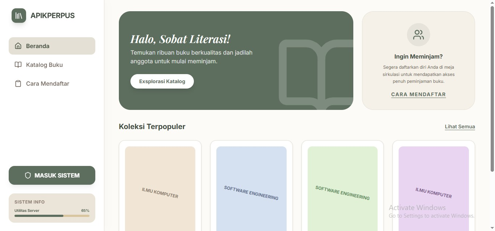
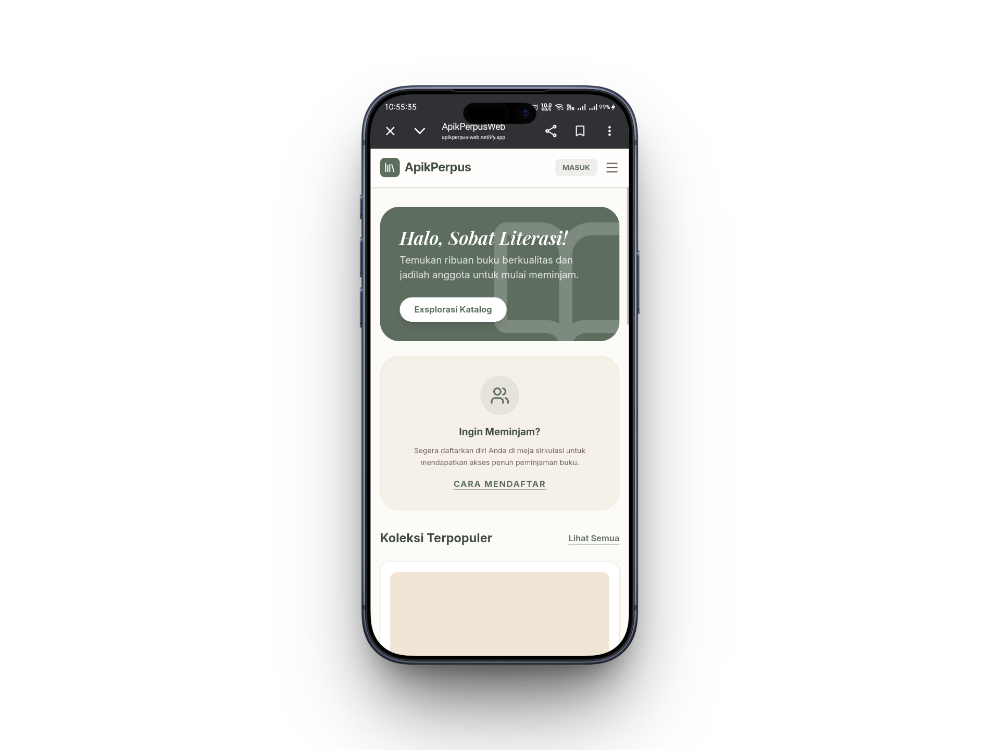

# 📚 ApikPerpusWeb V1

> Sistem perpustakaan berbasis web modern yang dirancang untuk membantu pengelolaan buku, peminjaman, dan akses pengguna dengan tampilan yang responsive dan user-friendly.

<p align="center">
  
</p>

---

## ✨ Tentang Project

ApikPerpusWeb V1 merupakan aplikasi perpustakaan digital berbasis web yang dikembangkan untuk membantu proses pengelolaan buku, data pengguna, serta sistem peminjaman secara lebih modern dan efisien.

Project ini berfokus pada:
- Pengalaman pengguna yang sederhana
- Responsive UI
- Sistem manajemen perpustakaan digital
- Dashboard modern
- Performa frontend yang optimal

ApikPerpusWeb V1 menjadi fondasi utama dalam pengembangan sistem perpustakaan digital sebelum implementasi teknologi Artificial Intelligence pada versi selanjutnya.

---

## 🚀 Fitur Utama

- 📚 Manajemen Buku
- 👤 Authentication & Authorization
- 🔍 Pencarian Buku
- 📱 Responsive Dashboard
- ⚡ UI Modern dan Cepat
- 🔐 Manajemen Pengguna
- 📖 Sistem Peminjaman Buku

---

## 🛠️ Tech Stack

| Technology | Description |
|---|---|
| React / Next.js | Frontend Framework |
| Tailwind CSS | Styling Framework |
| JavaScript / TypeScript | Programming Language |
| GitHub | Version Control |
| Netlify | Deployment Platform |

---

## 📸 Screenshot

### 🖥️ Tampilan Dekstop


---

### 📚 Sistem Perpustakaan


---

### 📱 Tampilan Mobile

<p align="center">
  
</p>

---

## 🌐 Live Demo

🔗 Website:

https://apikperpus-web.netlify.app/

---

## ⚙️ Instalasi

Clone repository:

```bash
git clone https://github.com/Rioalghanipratama/ApikPerpusWeb.V2.git
